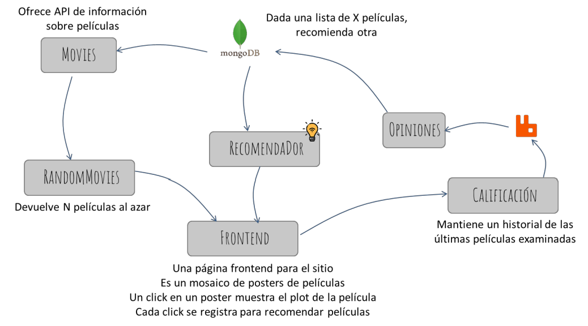

# microservices-project
Microservices project for a web catalog of films. Made for the assignment Tópicos Avanzados de Desarrollo Web (Advanced Topics in Web Development). Based in the following architecture

All you need to do is run the app

    $ docker compose up --build

Download the MFlix sample data
    
    $ curl  https://atlas-education.s3.amazonaws.com/sampledata.archive -o sampledata.archive

And import import it with `mongorestore`

    $ mongorestore --username admin --password 12345 --authenticationDatabase admin --archive=sampledata.archive --port=27017

Note: for use `mongorestore` you need the MongoDB Command Line Database Tools. You can download it from [MongoDB Download Center](https://www.mongodb.com/try/download/database-tools) and install it